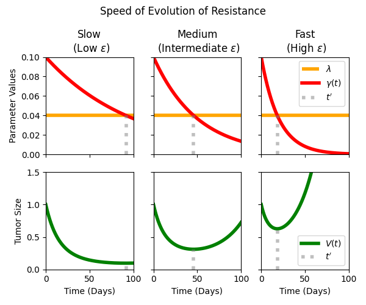

# Treatment Sequencing

Using TGI models to optimize treatment sequencing in KRAS-G12C-mutated lung cancer.

## Tumor Growth Inhibition (TGI) Model

In general, TGI models represent the change in tumor size ($V$) over time as a net growth effect, with the natural growth rate $\lambda$ modified by a drug‐induced decay effect (with rate $\gamma$). Specifically, we model decaying drug response, with the tumor evolving resistance to the drug at a speed $\epsilon$:

$$
\frac{dV}{dt} = \lambda V - \gamma V \quad,\quad \frac{d \gamma}{dt} = - \epsilon \gamma
$$

This simple model can replicate a diverse range of behavior, with three broad parameter regimes depicted below:

The code to generate this plot is given in the example notebook [`base_TGI_model`](base_TGI_model.ipynb).